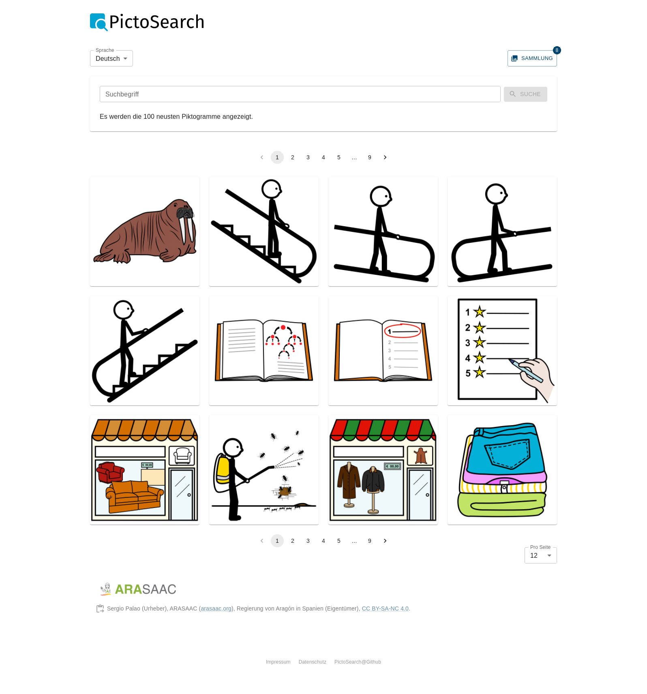
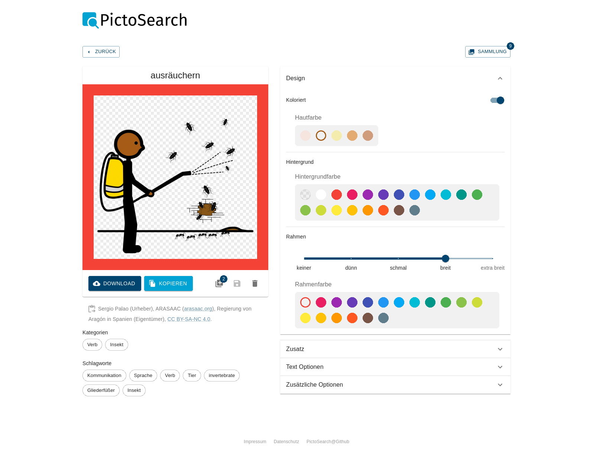

# Pictogram Viewer for Wordpress

This [Wordpress plugin][WP] provides a search and configuration dialog for
pictograms from [ARASAAC] for your site.

All pictographic symbols displayed and used are the property of the Government
of Aragón and have been created by Sergio Palao for [ARASAAC], that distributes
them under [Creative Commons License BY-NC-SA][CC].




## :heart_eyes: Features
This plugin provides the following features:

* Search and browse pictograms from ARASAAC
* Download or copy them to your clipboard with one click
* Configure your pictogram
    * Choose skin and hair color
    * Set background color
    * Add border in several sizes
    * Add different modifiers
    * Add text to top and bottom
    * And much more...

## :rocket: Install it
### Single page application
To use this app as single page application, just run `yarn install && yarn
build:app` and serve the content of `build/` with your favorite web server. Of
course you can also use `docker-compose up --build` to do it all in once. The
resulting web server is listing on port 8070 (http://localhost:8070/).

### Wordpress
The easiest way to install this plugin is to download the [latest release] and
extract it to `YOUR_WP_INSTALL/wp-content/plugins/`. If you like to use the
latest development version you have to download or clone this repo and compile
all dependencies. On Linux you can use the following commands:

```
cd YOUR_WP_INSTALL/wp-content/plugins/

wget https://github.com/kitsteam/wp-pictogram-viewer/archive/refs/heads/main.zip && unzip main.zip -d arasaac-pictogram-viewer
OR
git clone https://github.com/kitsteam/wp-pictogram-viewer.git arasaac-pictogram-viewer

cd arasaac-pictogram-viewer
yarn install && yarn build
```

After you installed the plugin you have to go to your Wordpress admin dashboard
and enable it. If done so, you can integrate the search and configuration dialog
to every page with the shortcode `[arasaac-pictogram-viewer]`.

## :performing_arts: Adding new translations
Currently this application is available in german and english. To add another
language, the following steps have to been taken:

* add the language short code to the `locales` short code in `i18next-parser.config.js`
* run `yarn i18next`
* translate everything in `src/locales/SHORT_CODE/translation.json`
* include the new data file in `src/locales/index.ts` like the existing

If a new translatable key is added to the code, `yarn i18next` will add it to all
language files.

## :train2: Protect user privacy
To protect the privacy of users, you can configure a proxy for all endpoints.

1. Configure a proxy for `https://api.arasaac.org/api` and
   `https://static.arasaac.org/images`. E.g. use can use [mod_proxy] (`ProxyPass
   "/api" "https://api.arasaac.org/api"`).
2. Set the environment variables `REACT_APP_API` and `REACT_APP_API_IMAGES` to
   the new absolute proxy url. The easiest way to do so, is to copy the file
   `.env` to `.env.local` and modify it accordantly.
3. Rebuild the project.

## :nerd_face: Release guide
To release a new version a few things should be done:

* Bump the version in `package.json`
* Add a version header field in `arasaac-pictogram-viewer.php`, like `* Version:           0.1.0`
* Run `yarn build && yarn run pack`
* Create a signed commit `git commit -S -am "release 0.1.0 :tada:"`
* Push all commits `git push`
* Create a [new Github release](https://github.com/kitsteam/wp-pictogram-viewer/releases/new) and attach the previous packed archive

## Additional licence

The PictoSearch [logo](https://thenounproject.com/icon/find-4161316/) in this
repo – created by [Sudarto Wasmad](https://thenounproject.com/sudartowasmad/)
– is licenced under [CC BY 3.0 Unported][CC-BY-3].

[WP]: https://wordpress.org
[ARASAAC]: http://www.arasaac.org
[CC]: https://creativecommons.org/licenses/by-nc-sa/4.0/deed.undefined
[CC-BY-3]: https://creativecommons.org/licenses/by/3.0/
[latest release]: https://github.com/kitsteam/wp-pictogram-viewer/releases